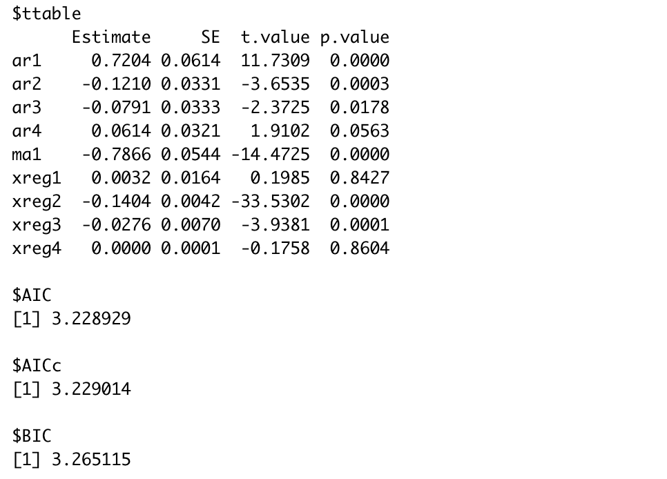
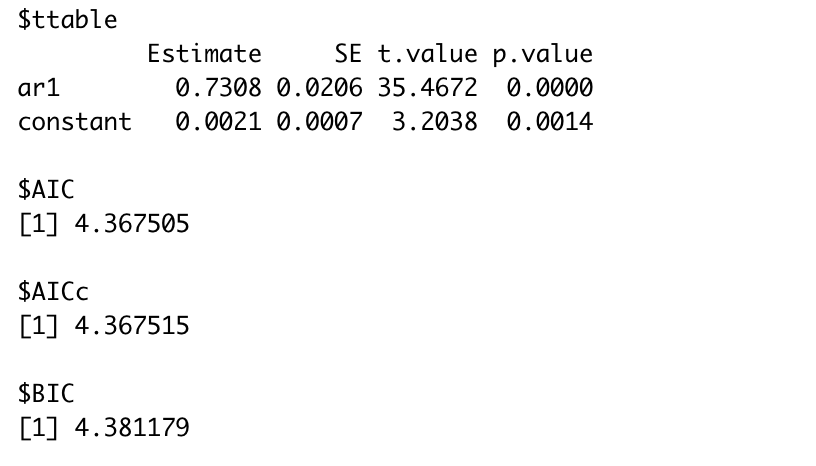
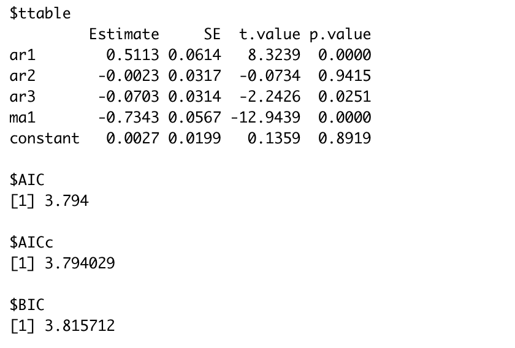

```{r setup, include=FALSE}
knitr::opts_chunk$set(echo = FALSE)
library(xts)
library(astsa)
library(MASS)
library(tidyverse)
library(nlme)
library(fpp2)
```

# Abstract

We here contact a time series analysis of temperature in Delphi, India. The main method of this report includes linear regression analysis, ARIMA model with seasonal effects, and exponential smoothing methods. We focus on examining the effect of some weather factors on the mean temperature, especially the time, and we make suggestions for the best models with their forecast values.  
  
# Introduction

Today, the climate problem has become an more and more important issue all over the world. It is useful to find a proper model which can help us monitor the change of temperature. So far, Weather Underground API took daily measurements of the city's climate and recorded them inside a database. For this project, the group is using weather data from Delphi, India containing information of  various climate factors ranging from January 1st, 2013 to April 24, 2017. Since then, this dataset was developed at PES University, Singapore in 2019 and posted to Kaggle around that same time.     
  
The goal of this report is to analyze the results of Delphi's temperature using multiple time series models. The response variable for the data is `meantemp`, the temperatures taken in Celsius from daily three-hour intervals. The predictor variables included the `dates` of the study as our time variable, the `humidity` in grams per cubic meters, `wind_speed` in kilometers per hour and `meanpressure` readings in atmospheres. Fitting data with regression models, SARIMA models, and exponential smoothing methods, we hope to identify a model that accurately demonstrates the change of the weather and could forecast it for the future. 

# Statistical Methods

For part A, we mainly use regression models to fit the data. Since there are multiple variables related to our response variable, its a popular start to first use linear regression. We initially assume all variables are used and the residuals are pure white noise. We use ANOVA test to decide whether we should keep the full model and check the normality assumption with the diagnostic plots. We also develop a regression model with autocorrelated errors since the residual plot shows a cyclical trend. Another method we try to use for removing the trending is differencing, so we fit a regression model to the response variable after taking difference. We look at their $R^2$ values, AIC and BIC values, and the diagnostic plot of residuals to decide the best model for this part.  
  
For part B, since the original time series plot of the response variable looks like containing some seasonal trend, we decide to fit a SARIMA model to see if it can perform better. We first check the ACF and PACF plot of the response variable to see if any necessary transformation should be taken. We then decide AR and MA operators for both normal part and seasonal part by looking at the ACF and PACF plot after transformation. We comparing SARIMA model with ARIMA model by looking at their AIC and BIC values as well as the residual diagnostic plots. Finally, the best model for this part is used to forecast future 5 values.  
  
For an advanced topic to analyze the data, the group chose exponential smoothing to search for more patterns in the data. Then we compare the selected model using the forecasting time series method with the best model we found in part A to determine the most suitable model for this dataset.

# Results  

## Part A  
  
### Preliminary Analysis  
  
```{r, message=FALSE}
data<-read.csv("DailyDelhiClimateTrain.csv")
data$date<-lubridate::ymd(data$date)
```

This dataset provides data of weather in Delphi, India from 1st January 2013 to 24th April 2017. In addition to time, there are 4 variables: `meantemp`, `humidity`, `wind_speed`, `meanpressure`. Here the variable `meantemp` is treated as response variable, which is the mean of temperature taken in Celsius from daily 3-hour intervals. All other variables, including `humidity` (the humidity in grams per cubic meters), `wind_speed`(wind speed in kmph), `meanpressure`(mean pressure readings in atm) as well as time (`date`) are considered as regressors.  
  
The following is a time series plot of `meantemp`.

```{r, out.width = '50%', fig.align = "center"}
tsplot(data$meantemp, ylab='meantemp')
```

According to the time series plot, there is a slightly increasing trend of the data over time. The variance roughly stays the same across time. The variable `meantemp` is not stationary.

In addition to that, there is also a clear seasonal pattern that the mean temperature peaks around summer in each year. But the seasonal pattern of the data will be addressed in Part B.

### Regression Analysis

### Model 1: Linear Regression with error as white noise assumption

We first consider a linear regression with all regressors included. The equation is as follows:

$$meantemp_{t}=\beta_0 + \beta_1*date_t+\beta_2*humidity_t+\beta_3*wind\_speed_t+\beta_4*meanpressure_t+W_t$$
```{r}
model1_1<-lm(meantemp~date+humidity+wind_speed+meanpressure,data=data)
summary(model1_1)
```

The fitting results show that $\hat{\beta_0}=9.01$, $\hat{\beta_1}=0.0019$, $\hat{\beta_2}=-0.23$, $\hat{\beta_3}=0.18$, $\hat{\beta_4}=0.0015$.

All regressors are significant (ps< .05) except for `meanpressure`. Thus we consider removing the variable `meanpressure`. And the resulting new model is $$meantemp_{t}=\beta_0 + \beta_1*date_t+\beta_2*humidity_t+\beta_3*wind\_speed_t+W_t$$

```{r include = FALSE}
model1_2<-lm(meantemp~date+humidity+wind_speed,data=data)
summary(model1_2)
```

The fitting results show that $\hat{\beta_0}=7.61$, $\hat{\beta_1}=0.0019$, $\hat{\beta_2}=-0.23$, $\hat{\beta_3}=0.18$, and all parameters are significant.  

The adjusted $R^2$ for this new model is 0.3471, which is smaller than the previous full model ($R^2$=0.3481). In addition, the AIC for the full model is 6.398, the BIC for the full model is 6.405. The AIC for the reduced model is 6.400, the BIC for the reduced model is 6.407. Taken together, the full model is preferred and we'll keep the full model, with all predictors are retained. 

```{r, results='hide', out.width = '50%', fig.align = "center"}
sarima(model1_1$residuals,0,0,0)
```

Above is a set of plots describing the characteristics of the model residual. we could easily see that the residual violates the normal assumption according to its deviation from the norm Q-Q plot and the significant p-value of rejecting Ljung-Box test. Thus we do not believe the residual is white noise and we believe the violation of white noise assumption will significantly harm model fit. Thus in the next part we tried to fit a linear model with autocorrelated errors.  

### Model 2: Linear Regression with autocorrelated errors

The linear regression with autocorrelated errors take the form of:

$$\pi(B)*meantemp_{t}=\sum^4_{j=0}\beta_j*\pi(B)*(date_t+humidity_t+wind\_speed_t+meanpressure_t)+\pi(B)*X_t$$

First of all, according to the residual plot above (under Model 1 section), we believe there is a slightly increasing trend in the error term, thus we applied differencing to the residual.

```{r, results='hide', out.width = '50%', fig.align = "center"}
acf2(diff(resid(model1_1)))
```

Taking a look at the ACF and PACF of the plot, both ACF and PACF are tailing off. Thus we believe an ARMA model would be a good fit for the differenced residual.  

```{r, out.width = '50%', fig.align = "center"}

```

```{r, results='hide', out.width = '50%', fig.align = "center"}
sarima(data$meantemp, 4,1,1, xreg=cbind(data$date, data$humidity, data$wind_speed, data$meanpressure))
```


Comparing model of all orders, ARIMA model (4,1,1) has the smallest AIC and BIC. Thus we believe ARIMA model (4,1,1) is the best fit for the error term with the lowest AIC value(AIC=3.229, BIC=3.265). In addition, based on the diagnostic plots above, the residuals approximately follow the normal Q-Q plot, and the Ljung-Box statistics do not reject the null hypothesis. These evidence prove that after adding ARIMA operators, the error term approximates to white noise. 

The estimated ARIMA parameters for the error term are AR(1)=0.7204, AR(2)=-0.1210, AR(3)=0.0791, AR(4)=0.0614, MA(1)=-0.7866. 

In the next part, we explore whether differencing the response variable will result in a better model fit.

### Model 3: Linear Regression with differenced response variable

We start with the model of differenced response variable and white noise error assumption.

$$meantemp_{t}-meantemp_{t-1}=\beta_0 + \beta_1*date_t+\beta_2*humidity_t+\beta_3*wind\_speed_t+\beta_4*meanpressure_t+W_t$$
```{r include=FALSE}
model3<-lm(c(meantemp[1],diff(meantemp))~date+humidity+wind_speed+meanpressure,data=data)
summary(model3)
```

After differencing, the model has a really poor fit with variable `date` and `mean_pressure` insignificant. The adjusted $R^2$ is also low (adjusted $R^2$=0.045). Thus, we decide to not further pursue this path.

Taken together, the linear model with all the predictors `date`, `humidity`, `wind_speed` and `meanpressure` included and with the autocorrelated error following ARIMA(4,1,1) performs best.

However, one thing to notice is that the response variable seems to follow a seasonal pattern. In Part A, we hasn't been able to take this seasonal pattern into consideration. In the next Part, we will keep exploring whether a seasonal model would be a better fit of the data.

## Part B

### Preliminary Analysis  

In this part, we are using the same dataset used in Part A (refer to Part A for time series plot of `meantemp`). And we will only explore the time-series pattern of `meantemp` without considering other regressors. There is a clear yearly seasonal pattern with a lag of 365.

### SARIMA Model Analysis

The yearly seasonal pattern with a lag of 365 requires a seasonal differencing of 365. The time-series plot with a seasonal differencing of lag 365 is attached below.

```{r, out.width = '50%', fig.align = "center"}
tsplot(diff(data$meantemp,365))
```

After seasonal differencing there is no longer a clear trend so the normal differencing is not required. We will further determine the SARIMA model from ACF and PACF plots.

```{r, results=FALSE, out.width = '50%', fig.align = "center"}
#acf2(diff(data$meantemp,365),1000)
acf2(diff(data$meantemp,365))
```

After seasonal differencing, there isn't a clear seasonal pattern in the plots. For the non-seasonal part, since ACF is tailing off, and PACF is cutting off after 1, we would suggest an AR(1) model. Taken together, an SAMIRA $(1,0,0)*(0,1,0)_{365}$ model would be appropriate.

```{r, out.width = '50%', fig.align = "center"}

```

```{r, results='hide', out.width = '50%', fig.align = "center"}
sarima(data$meantemp,1,0,0,0,1,0,365)
```

The estimated parameter for the non-seasonal AR(1) part is 0.7308.
Above is a set of plots describing the characteristics of the model residual. we could easily see that the residual violates the normal assumption. Thus we do not believe the residual is white noise. The AIC and BIC for the built SARIMA model is 4.368 and 4.381, respectively.  
  
Then we decide to use normal ARIMA model without seasonal lags to see if it can perform better, since the residual plot after regular differencing also looks white.

```{r, out.width = '50%', fig.align = "center"}
tsplot(diff(data$meantemp))
```

```{r, results=FALSE, out.width = '50%', fig.align = "center"}
acf2(diff(data$meantemp))
```

To determine the ARIMA operators, since its ACF and PACF are both tailing off after 3, we first try to use ARIMA(3,1,3). However, the p-values for MA(2) and MA(3) are not significant. Finally, after comparing various ARIMA models, we find ARIMA(3,1,1) model fits the data best with the lowest AIC and BIC value.

```{r, out.width = '50%', fig.align = "center"}

```

```{r, results='hide', out.width = '50%', fig.align = "center"}
sarima(data$meantemp,3,1,1)
```

The result shows all our parameters are significant except for AR(2), but its fine as long as AR(3) is significant. We get AR(1)=0.5113, AR(2)=-0.0023, AR(3)=-0.0703, and MA(1)=-0.7343. Notice that the ARIMA(3,1,1) model has a AIC value of 3.794 and BIC value of 3.816 which are both smaller than the SARIMA $(1,0,0)*(0,1,0)_{365}$ model we fit before. Also, the residuals diagnostic plots of ARIMA(3,1,1) model look closer to white noise. Thus we believe the ARIMA(3,1,1) model performs better than the SARIMA $(1,0,0)*(0,1,0)_{365}$ model, and we then use it to forecast the future 5 values.

```{r, out.width = '50%', fig.align = "center"}
sarima.for(data$meantemp, 5, 3,1,1)
title("Forecast Future 5 Values Using ARIMA(3,1,1)")
```

## Part C  
  
By using the forecasting time series method, we find another model based on the regression model with autocorrelated errors in part A. 

$$\pi'(B)*meantemp_{t}=\sum^5_{j=0}\beta_j*\pi'(B)*(date_t+humidity_t+wind\_speed_t+meanpressure_t)+\pi'(B)*X_t$$

After using the multiple decomposition method to check for cycles in the data besides annual cycles, the four years of data were forecast using a fourier series. In this model, adding one additional variable for the AR and MA parts each was considered the best model for forecasts of `meantemp` for four additional years.  
  
As the figure shown below, there were no additional cycles besides the annual cycle, but there was a trend that became increasingly positive as the years passed.  

``` {r, message=FALSE, out.width = '50%', fig.align = "center"}
series <- ts(data$meantemp, frequency=365, start=c(2013, 1, 1)) 
series %>% mstl() %>% autoplot() + xlab("Years") + ylab("meantemp(Celsius)")
```

As the figure shown below, the forecast suggests that if the data continued onto later years, the temperatures would become even higher overall and throughout the seasonal cycle. The most effective forecast involved ARIMA(5,1,2) instead of our best model of ARIMA(4,1,1).  

``` {r, message=FALSE, results='hide', out.width = '50%'}
par(mfrow=c(1,2))
fit <- auto.arima(series, seasonal=FALSE, lambda=0, xreg=fourier(series, K=10))
fit %>% forecast(xreg=fourier(series, K=10, h=4*365)) %>% autoplot(include=5*365) + ylab("meantemp (observed and expected)") + xlab("Years")
sarima(data$meantemp, 5,1,2)
```

Above is a set of plots describing this model residual. This model contains residuals that violate the normal assumption and lag p-values that reject the null hypothesis. From there, the error terms (AIC=3.77, BIC=3.81) are slightly higher that for ARIMA model(4,1,1). To that end, we stuck with the selected model in part A.

# Discussion

In general, we explore multiple time series models for the weather data in Delphi, including linear regression, SARIMA, and exponential smoothing. We find that the linear regression model with autocorrated errors of ARIMA(4,1,1) outperforms than the other regression models with the lowest AIC and BIC value as well as its residuals are closer to white noise. We also notice that the normal ARIMA(3,1,1) model performs better than the SAMIRA $(1,0,0)*(0,1,0)_{365}$ model, even though the time series plot of the data appears an annual cyclical trend. However, the AIC and BIC value of ARIMA(3,1,1) model are still larger than that of the regression model with autocorrated errors we found in part A. In the end, we use exponential smoothing with forecasting time series method which suggesting a regression model with autocorrated errors of ARIMA(5,1,2), but its residual diagnostic plots prove the violation of the normal assumption. Again, its AIC and BIC value are larger than the model we found in part A. Overall, we believe the linear regression model with autocorrated errors of ARIMA(4,1,1) fits the data best with the smallest AIC and BIC value. Besides, the diagnostic plots show its residuals are the closest to white noise. While, there are still some limitation to our research. For example, we don't have enough data for a longer time period since the trend happens annually. Also, there might be other factors which could affect the temperature but aren't recorded in the dataset. For the future study, we suggest to explore more different time series models and play with various AR and MA operator. One can also comparing the accuracy of forecasting, such as MSPE (mean squared prediction error), for each model to decide the best model for a specific purpose. 